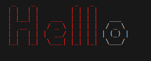
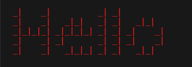

This project enables you to colorize the output to give a distiction of the words or characters as specified. It allows you to specify the banner file which you want your output to take its representation. It also allows you to color some specified substring in your string.


## Features
Some of the key features here are as follows: 

- Convert strings into Ascii Art with different representations.
- Supports numbers, letters, spaces and newline characters ('\n').
- Some special characters are handled with messages.


## Installation
This project is purely written in Go languange, ensure you have Go installed in your computer.

1. Clone the repo: 

```bash
https://learn.zone01kisumu.ke/git/beopiyo/ascii-art-color.git
```
2. Navigate to the project directory:
```bash
cd ascii-art-color/
```

## Usage

To run this project you can use different ways as in the examples below:

1. ``` go run . Hello ``` gives the following output

```code
 _    _          _   _          
| |  | |        | | | |         
| |__| |   ___  | | | |   ___   
|  __  |  / _ \ | | | |  / _ \  
| |  | | |  __/ | | | | | (_) | 
|_|  |_|  \___| |_| |_|  \___/  
                                
                                
```

2. ``` go run . --color=red Hell "Hello" ``` gives the following output



3. ``` go run . --color=red "Hello" shadow ``` this gives the following output.




**Note:** For each way above you can specify the banner file you desire from standard, shadow and thinkertoy.

## Test
We have tests which tests possible cases and to run the test:
- Navigate to the tests directory and run this:  ``` go test -v ```

## Implementation
Below is a snippet of a function that validates the flag passed. It ensures that the format of the flag follows the format --color= else it gives the user the usage message.

```go
func ValidateFlagFormat() {
	valid := true

	// Check if flags are in the correct format
	flag.VisitAll(func(f *flag.Flag) {
		found := false
		for _, arg := range os.Args[1:] {
			if strings.HasPrefix(arg, "--"+f.Name+"=") {
				found = true
				break
			}
		}
		if !found && flagIsSet(f.Name) {
			valid = false
		}
	})
    // ...
}
 ```

## Contribution

We are open for corrections and for any contributions please create a pull request, thanks.


## Authors
This project is maintained by:

[Benard Opiyo](https://github.com/benardopiyo)

[Doreen Onyango](https://github.com/Doreen-Onyango)

[Stephen Omotto](https://github.com/somotto)

